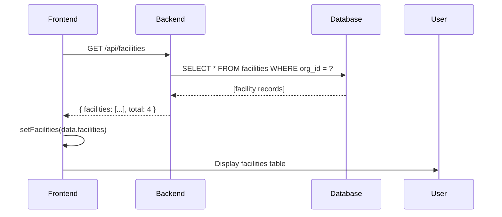
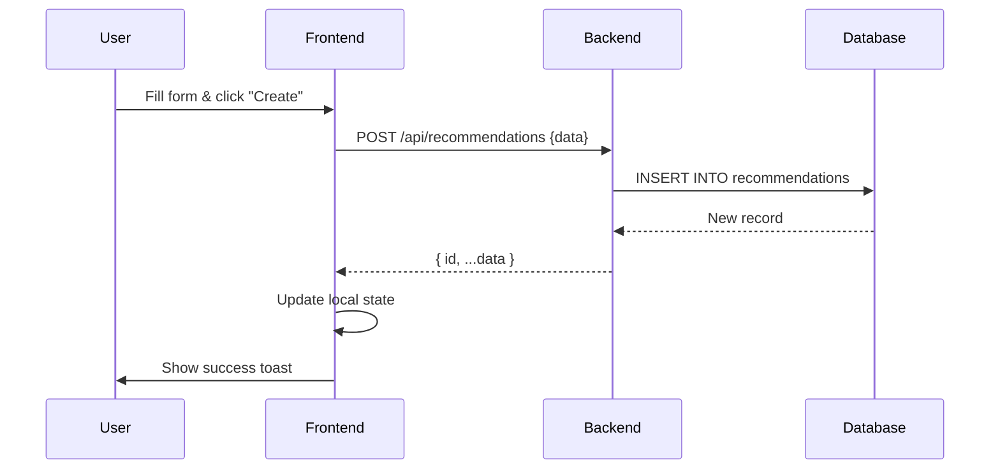
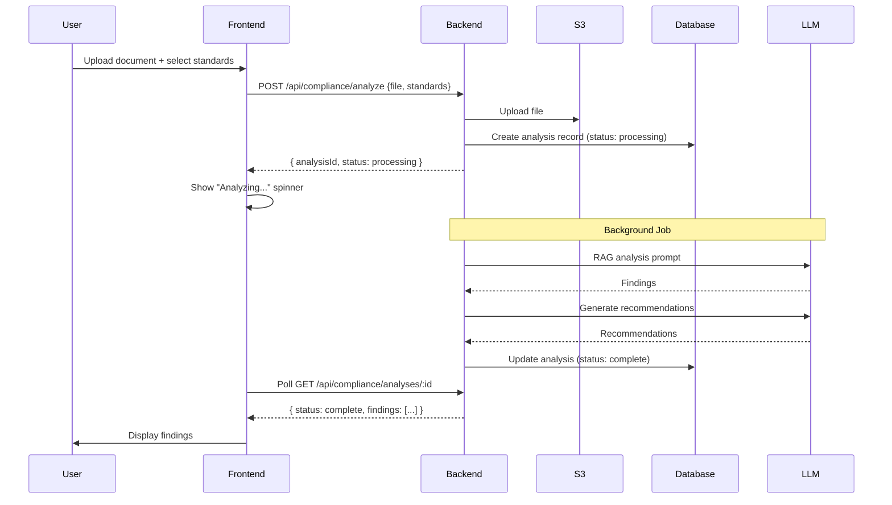

# Prognos Frontend - Backend Integration Guide

**Prognos** is a next-generation Process Safety Management (PSM) platform for high-hazard industries. This repository contains the **frontend-only** React/TypeScript application.

## 🏗️ Architecture Overview

```
┌─────────────────────────────────────┐
│   Prognos Frontend (This Repo)     │
│   - React 19 + TypeScript           │
│   - Tailwind CSS + shadcn/ui        │
│   - State: useKV (local storage)    │
│   - Charts: Recharts                │
└──────────────┬──────────────────────┘
               │
               │ REST API (HTTPS)
               │ WebSocket (optional)
               │
┌──────────────▼──────────────────────┐
│   Prognos Backend (Separate Repo)  │
│   - Node.js/Python (TBD)            │
│   - PostgreSQL Database             │
│   - OpenAI API Integration          │
│   - JWT Authentication              │
└─────────────────────────────────────┘
```

## 📋 Current Status

### ✅ Completed (Frontend-Only Mode)
- Full UI/UX implementation for all modules
- Mock data and seed data for development
- Local state management with `useKV`
- Client-side AI analysis (demo only - **not production ready**)
- All views: Dashboard, Recommendations, PHA, MOC, Analytics, Aura AI
- shadcn/ui component library integration
- Responsive design

### ❌ Not Implemented (Requires Backend)
- User authentication & authorization
- Real data persistence (multi-user, multi-device)
- Backend API integration
- File upload/storage
- Production-ready AI analysis
- Real-time collaboration
- Audit trails
- Multi-tenancy/organization support

## 📁 Repository Structure

```
/workspaces/spark-template/
├── BACKEND_API_REQUIREMENTS.md      ← Complete API specification
├── BACKEND_INTEGRATION_TODOS.md     ← Detailed integration tasks
├── README_BACKEND_INTEGRATION.md    ← This file
├── PRD.md                            ← Product requirements
├── src/
│   ├── App.tsx                       ← Main app (uses mock data)
│   ├── components/
│   │   ├── views/
│   │   │   ├── dashboard-view.tsx
│   │   │   ├── recommendations-view.tsx
│   │   │   ├── pha-view.tsx
│   │   │   ├── moc-view.tsx
│   │   │   ├── analytics-view.tsx
│   │   │   └── aura-view.tsx        ← AI compliance engine
│   │   └── ui/                       ← shadcn components
│   ├── lib/
│   │   ├── api.ts                    ← API client (stub methods)
│   │   ├── types.ts                  ← TypeScript types
│   │   ├── seed-data.ts              ← Mock data
│   │   └── helpers.ts
│   └── hooks/                        ← Custom React hooks
└── ...
```

## 🔗 Key Documents

### For Backend Developers

1. **[BACKEND_API_REQUIREMENTS.md](./BACKEND_API_REQUIREMENTS.md)**
   - Complete REST API specification
   - All endpoints with request/response formats
   - Authentication requirements
   - Error handling standards
   - Technology recommendations

2. **[BACKEND_INTEGRATION_TODOS.md](./BACKEND_INTEGRATION_TODOS.md)**
   - Detailed TODO list for frontend integration
   - Code examples for each module
   - Migration path from mock data to real APIs
   - Testing requirements
   - Priority/phasing recommendations

3. **[PRD.md](./PRD.md)**
   - Product requirements document
   - Feature specifications
   - User personas
   - Success metrics

### For Frontend Developers

All integration work centers around these files:
- `src/lib/api.ts` - Implement all API methods
- `src/App.tsx` - Replace `useKV` with API calls
- `src/components/views/*.tsx` - Add loading states, error handling

## 🚀 Quick Start for Backend Integration

### Step 1: Set Up Environment Variables

Create `.env.development`:
```bash
VITE_API_BASE_URL=http://localhost:3000/api
VITE_WS_URL=ws://localhost:3000/ws
```

Create `.env.production`:
```bash
VITE_API_BASE_URL=https://api.prognos.com/api
VITE_WS_URL=wss://api.prognos.com/ws
```

### Step 2: Implement API Client

Open `src/lib/api.ts` and implement the stubbed methods:

```typescript
// BEFORE (current state)
async getFacilities(): Promise<{ facilities: Facility[]; total: number }> {
  throw new Error('Backend API not implemented')
}

// AFTER (with backend integration)
async getFacilities(): Promise<{ facilities: Facility[]; total: number }> {
  return this.get<{ facilities: Facility[]; total: number }>('/facilities')
}
```

### Step 3: Add Authentication

The `getAuthHeader()` method needs to return the JWT token:

```typescript
private getAuthHeader(): HeadersInit {
  const token = localStorage.getItem('auth_token')
  if (!token) return {}
  
  return {
    'Authorization': `Bearer ${token}`
  }
}
```

### Step 4: Replace Mock Data with API Calls

Example for facilities in `src/App.tsx`:

```typescript
// BEFORE
const [facilities, setFacilities] = useKV<Facility[]>('facilities', [])

useEffect(() => {
  if (!facilities || facilities.length === 0) {
    setFacilities(sampleFacilities)
  }
}, [])

// AFTER
const [facilities, setFacilities] = useState<Facility[]>([])
const [loading, setLoading] = useState(true)

useEffect(() => {
  const loadFacilities = async () => {
    try {
      const data = await api.getFacilities()
      setFacilities(data.facilities)
    } catch (error) {
      toast.error('Failed to load facilities')
    } finally {
      setLoading(false)
    }
  }
  loadFacilities()
}, [])
```

## 📊 Data Flow Examples

### Example 1: Loading Facilities



### Example 2: Creating Recommendation



### Example 3: AI Compliance Analysis (Aura)



## 🔒 Security Considerations

### Frontend Responsibilities
- Store JWT tokens securely (httpOnly cookies preferred)
- Validate all user inputs before sending to backend
- Never expose API keys or secrets
- Implement CSRF protection
- Sanitize displayed data to prevent XSS

### Backend Responsibilities (from API spec)
- Authenticate all requests (except `/auth/*`)
- Implement rate limiting
- Validate and sanitize all inputs
- Use parameterized queries (prevent SQL injection)
- Implement proper CORS policies
- Log all sensitive operations
- Encrypt data at rest and in transit

### Aura AI Security
⚠️ **Critical**: The current implementation uses `spark.llm` in the browser, which is **only for demo purposes**. Production implementation MUST:
- Move all LLM calls to the backend
- Never expose OpenAI API keys in frontend code
- Process documents server-side
- Implement proper rate limiting on AI endpoints

## 📝 API Client Usage Examples

### Fetching Data
```typescript
import { api } from '@/lib/api'

const { facilities } = await api.getFacilities()

const { recommendations } = await api.getRecommendations({
  facilityId: 'fac-001',
  status: 'open',
  riskLevel: 'critical'
})
```

### Creating Resources
```typescript
const newFacility = await api.createFacility({
  name: 'New Facility',
  location: 'Houston, TX'
})

const newRec = await api.createRecommendation({
  facilityId: 'fac-001',
  title: 'Fix critical issue',
  riskLevel: 'critical',
  assigneeId: 'user-123',
  dueDate: '2025-06-30'
})
```

### Updating Resources
```typescript
await api.updateRecommendation('rec-001', {
  status: 'in-progress'
})

await api.completeRecommendation('rec-001', {
  closureEvidence: 'Installed new valve',
  attachmentUrls: ['https://s3.../photo.jpg']
})
```

### File Uploads
```typescript
const result = await api.uploadFile(file, 'evidence', 'rec-001')
console.log(result.url)
```

## 🧪 Testing Strategy

### Unit Tests
```bash
npm run test
```

Test all API methods with mocked fetch:
```typescript
import { api } from '@/lib/api'

jest.mock('global.fetch')

test('getFacilities returns facilities', async () => {
  global.fetch = jest.fn().mockResolvedValue({
    ok: true,
    json: async () => ({ facilities: [...] })
  })
  
  const result = await api.getFacilities()
  expect(result.facilities).toHaveLength(4)
})
```

### Integration Tests
Use Mock Service Worker (MSW) to mock the backend:
```typescript
import { rest } from 'msw'
import { setupServer } from 'msw/node'

const server = setupServer(
  rest.get('/api/facilities', (req, res, ctx) => {
    return res(ctx.json({ facilities: [...] }))
  })
)
```

## 🎯 Implementation Phases

### Phase 1: Core Functionality (Week 1-2)
- [ ] Authentication & authorization
- [ ] Facilities CRUD
- [ ] Recommendations CRUD
- [ ] Dashboard metrics
- [ ] Error handling & loading states

### Phase 2: Full Feature Set (Week 3-4)
- [ ] PHA module integration
- [ ] MOC module integration
- [ ] Analytics integration
- [ ] File upload functionality

### Phase 3: Advanced Features (Week 5+)
- [ ] Aura AI backend integration
- [ ] Real-time updates (WebSocket)
- [ ] Advanced caching (React Query)
- [ ] Performance optimization

## 🐛 Common Issues & Solutions

### Issue: CORS errors
**Solution**: Backend must enable CORS for frontend domain:
```javascript
// Backend CORS config
app.use(cors({
  origin: 'http://localhost:5173',
  credentials: true
}))
```

### Issue: 401 Unauthorized on all requests
**Solution**: Check `getAuthHeader()` implementation and token storage

### Issue: File upload fails
**Solution**: Ensure backend accepts multipart/form-data and frontend doesn't set Content-Type header (browser sets it automatically)

### Issue: TypeScript errors on API responses
**Solution**: Ensure backend response types match `src/lib/types.ts` exactly

## 📞 Backend Team Coordination

### Information Needed from Backend Team

1. **API Base URL**
   - Development: `http://localhost:????`
   - Staging: `https://staging-api.???`
   - Production: `https://api.???`

2. **Authentication Flow**
   - JWT expiration time?
   - Refresh token implementation?
   - Login endpoint behavior?

3. **File Upload**
   - Max file size?
   - Supported file types?
   - Storage location (S3 URL pattern)?

4. **Aura AI**
   - Expected analysis processing time?
   - Polling interval recommendation?
   - Or webhook URL for completion notification?

5. **Rate Limiting**
   - Limits per endpoint?
   - How to handle 429 responses?

6. **WebSocket**
   - Will it be available?
   - Connection URL?
   - Event format?

### Frontend Team Can Provide

1. **Type Definitions** (`src/lib/types.ts`)
   - All TypeScript interfaces
   - Can generate JSON schemas if needed

2. **API Contract** (`BACKEND_API_REQUIREMENTS.md`)
   - Complete API specification
   - Request/response formats

3. **Test Data** (`src/lib/seed-data.ts`)
   - Sample data for development
   - Can provide SQL seed scripts

## 📚 Additional Resources

- [React Documentation](https://react.dev)
- [TypeScript Handbook](https://www.typescriptlang.org/docs/)
- [shadcn/ui Components](https://ui.shadcn.com/)
- [Tailwind CSS](https://tailwindcss.com/)
- [Recharts Documentation](https://recharts.org/)

## ✅ Integration Checklist

Use this checklist to track backend integration progress:

### Authentication
- [ ] Login endpoint integrated
- [ ] Logout endpoint integrated
- [ ] Token storage implemented
- [ ] Token refresh flow (if applicable)
- [ ] Protected routes implemented
- [ ] Redirect to login when unauthorized

### Facilities Module
- [ ] GET /api/facilities
- [ ] GET /api/facilities/:id
- [ ] POST /api/facilities
- [ ] PATCH /api/facilities/:id
- [ ] DELETE /api/facilities/:id
- [ ] Loading states
- [ ] Error handling

### Recommendations Module
- [ ] GET /api/recommendations (with filters)
- [ ] GET /api/recommendations/:id
- [ ] POST /api/recommendations
- [ ] PATCH /api/recommendations/:id
- [ ] POST /api/recommendations/:id/complete
- [ ] DELETE /api/recommendations/:id
- [ ] Create/Edit dialog
- [ ] Loading states
- [ ] Error handling

### PHA Module
- [ ] All CRUD endpoints
- [ ] Create/Edit dialogs
- [ ] Loading states
- [ ] Error handling

### MOC Module
- [ ] All CRUD endpoints
- [ ] Approval workflow
- [ ] Rejection workflow
- [ ] Loading states
- [ ] Error handling

### Analytics Module
- [ ] GET /api/analytics/incident-trends
- [ ] GET /api/analytics/risk-trends
- [ ] GET /api/analytics/dashboard-metrics
- [ ] Date range filters
- [ ] Loading states
- [ ] Error handling

### Aura AI Module
- [ ] GET /api/compliance/standards
- [ ] POST /api/compliance/standards
- [ ] POST /api/compliance/analyze
- [ ] GET /api/compliance/analyses/:id
- [ ] PATCH .../findings/:id
- [ ] POST .../findings/:id/create-recommendation
- [ ] Polling implementation
- [ ] Loading states
- [ ] Error handling

### File Upload
- [ ] POST /api/files/upload
- [ ] DELETE /api/files/:id
- [ ] Progress tracking
- [ ] File type validation
- [ ] Size limit handling

### Infrastructure
- [ ] Environment variables configured
- [ ] Error tracking (Sentry/LogRocket)
- [ ] Performance monitoring
- [ ] Unit tests passing
- [ ] Integration tests passing
- [ ] E2E tests passing
- [ ] Production build tested

---

## 🤝 Contributing

### For Frontend Developers
1. All API integration work should reference `BACKEND_INTEGRATION_TODOS.md`
2. Update types in `src/lib/types.ts` if backend changes schema
3. Add tests for each integration
4. Update this README when adding new features

### For Backend Developers
1. Use `BACKEND_API_REQUIREMENTS.md` as the contract
2. Ensure responses match TypeScript types in `src/lib/types.ts`
3. Notify frontend team of any API changes
4. Provide staging environment for integration testing

---

## 📄 License

See LICENSE file in the root directory.

---

## 💬 Support

For questions about:
- **Frontend implementation**: Contact frontend team
- **Backend API**: See `BACKEND_API_REQUIREMENTS.md`
- **Product requirements**: See `PRD.md`
- **Integration tasks**: See `BACKEND_INTEGRATION_TODOS.md`

---

**Last Updated**: December 2024  
**Version**: 1.0 (Frontend-Only Mode)
